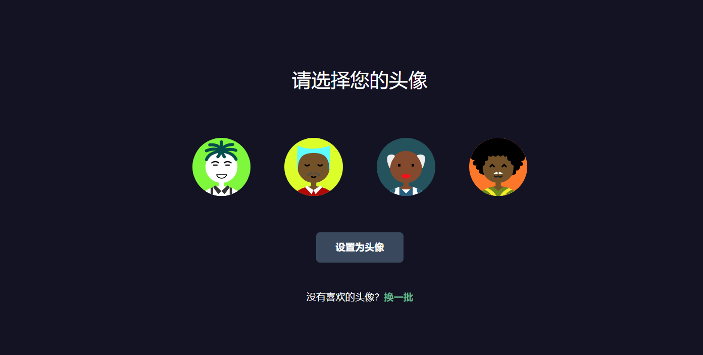

### 启动指南

#### 前端

1.输入“npm install”安装依赖包

2.输入“npm run dev”启动

#### 后端

1.输入“npm install”安装依赖包

2.输入“npm run dev”启动

### 技术栈

#### 前端

axios、sass、ant-design-vue@next、vue3-emoji、socket.io-client

#### 后端

express、mongoose、socket.io、cors、dotenv

### 演示效果

<table>
    <tr>
        <td></td>
        <td></td>
    </tr>
    <tr>
        <td></td>
        <td></td>
    </tr>
    <tr>
        <td></td>
        <td></td>
    </tr>
</table>